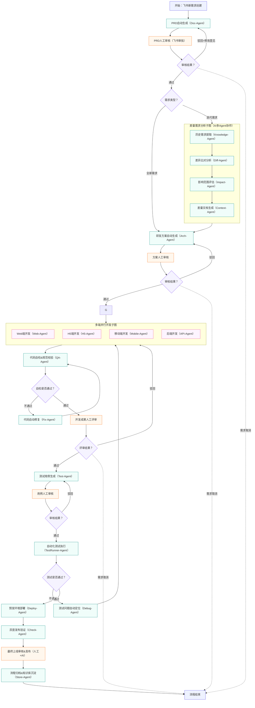

---

# 企业研发流程 AI 自动化 Agent 系统设计方案
## 一、项目背景与目标
### 1.1 现有流程
公司现有业务包含：**前端 Web、H5、移动端、后端服务**四类项目，需求管理、流程节点、任务审批均基于**飞书项目管理**完成，人工参与全流程执行，效率偏低、标准化不足。

### 1.2 改造目标
引入 AI Agent 自动化执行全流程节点，实现：
- AI 负责：需求分析、PRD 生成、差量分析、多端开发、代码自检、测试用例、自动化测试、部署等
- 人工只负责：各节点结果审核、驳回修正、最终上线确认
- 流程自动流转、自动重试、自动修复、自动归档
- 与飞书项目深度打通，保持现有协作习惯不变

---

## 二、AI 自动化工作流完整设计
### 2.1 流程图说明
本流程基于 LangGraph 设计，包含：子图、条件分支、并行执行、循环回流、异常终止，完全贴合真实互联网研发流程。

### 2.2 Mermaid 流程图代码
可直接粘贴至 https://mermaid.live/ 生成高清流程图：

---

## 三、核心技术框架选型
### 3.1 核心编排框架
**唯一选择：LangGraph + LangChain**
- 原生支持子图、条件分支、并行、循环、状态持久化
- 与流程图结构 1:1 映射，开发成本最低
- 企业级 AI Agent 系统行业事实标准

### 3.2 后端服务
- FastAPI：轻量、高性能、适合 AI 服务接口化
- 提供：启动流程、审核回调、状态查询、日志查询接口

### 3.3 前端呈现方案（行业主流）
**最终选择：Web 平台（内网网页）**
- 95% 企业级 AI 协作系统均采用 Web 形态
- 可直接嵌入飞书工作台，全员无需安装软件
- 支持流程可视化、审核操作、进度查看

> 备选快速方案：Streamlit（1 小时出可演示 Web 界面）

### 3.4 集成能力
- 飞书开放平台 SDK：消息推送、审批回调、项目状态同步
- 大模型接口：GPT / 通义千问 / 文心一言等
- 代码仓库、测试平台、部署平台对接

---

## 四、系统呈现形态对比与结论
| 方案 | 适用场景 | 团队体验 | 飞书集成 | 最终选择 |
|------|----------|----------|----------|----------|
| 终端 CLI | 个人极客工具 | 极差 | 无法集成 | 否 |
| 桌面客户端 | 本地工具 | 一般 | 复杂 | 否 |
| Web 网页平台 | 企业协作、多人审核 | 优秀 | 无缝集成 | **是** |

---

## 五、落地实施步骤（第一步优先）
1. **LangGraph 流程编码**
   将 Mermaid 流程图翻译为 State、节点、条件边、子图。

2. **搭建最小 Web 演示系统**
   使用 Streamlit / FastAPI + 简单页面，实现：
   - 发起需求
   - 查看 AI 执行进度
   - 人工审核通过/驳回

3. **对接飞书**
   实现消息推送、审核卡片、状态同步。

4. **逐步接入真实开发、测试能力**
   先跑通流程，再逐步增强各 Agent 能力。

---

## 六、方案核心价值
1. 研发流程标准化、自动化，减少重复人工劳动
2. AI 负责执行，人工专注审核与决策
3. 流程可回溯、可监控、可优化
4. 完全贴合现有飞书协作体系，无额外学习成本
5. 基于 LangGraph 可无限扩展后续能力

---
